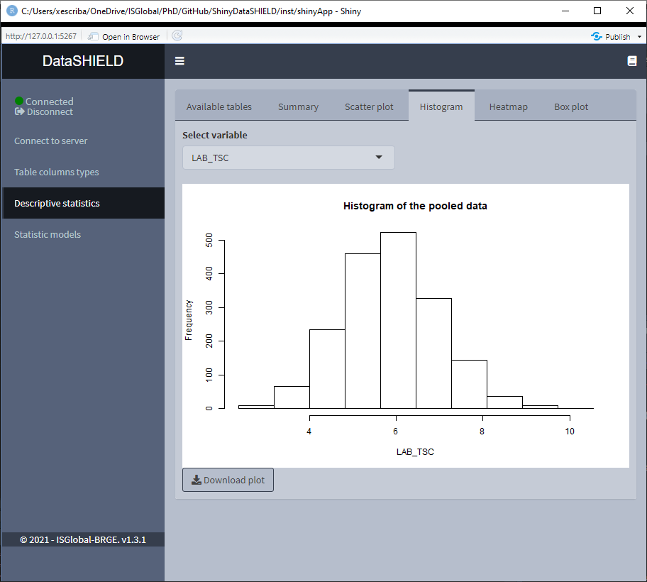
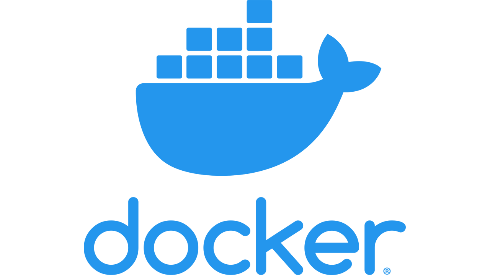
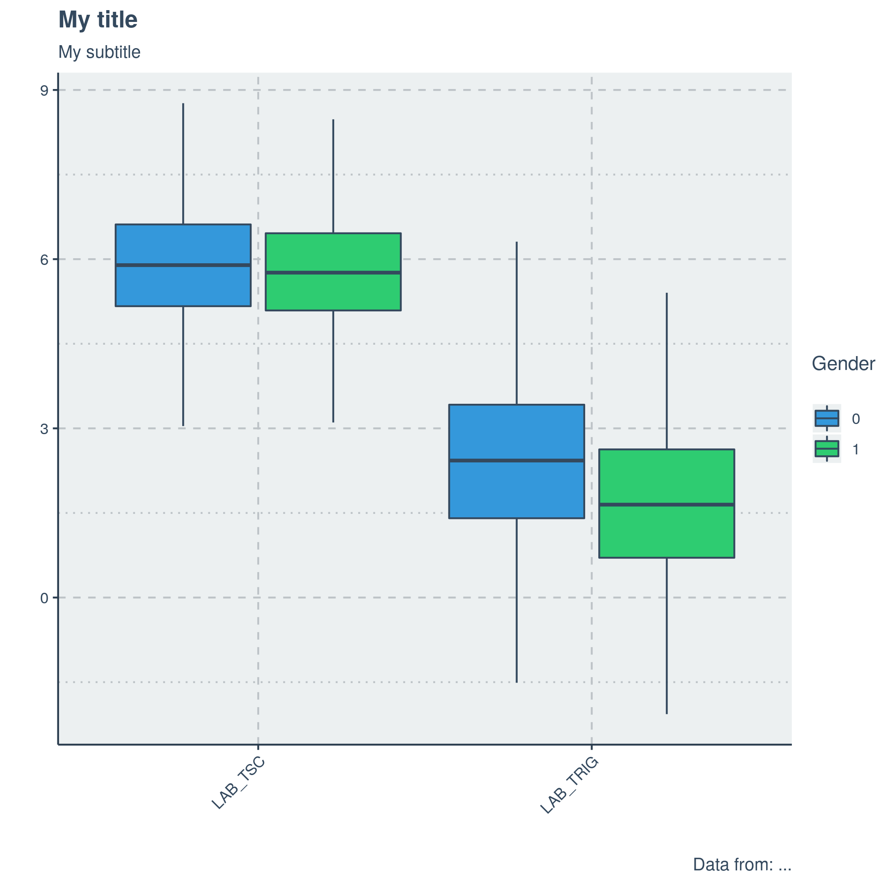
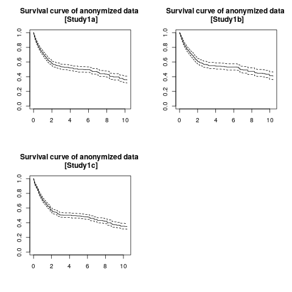
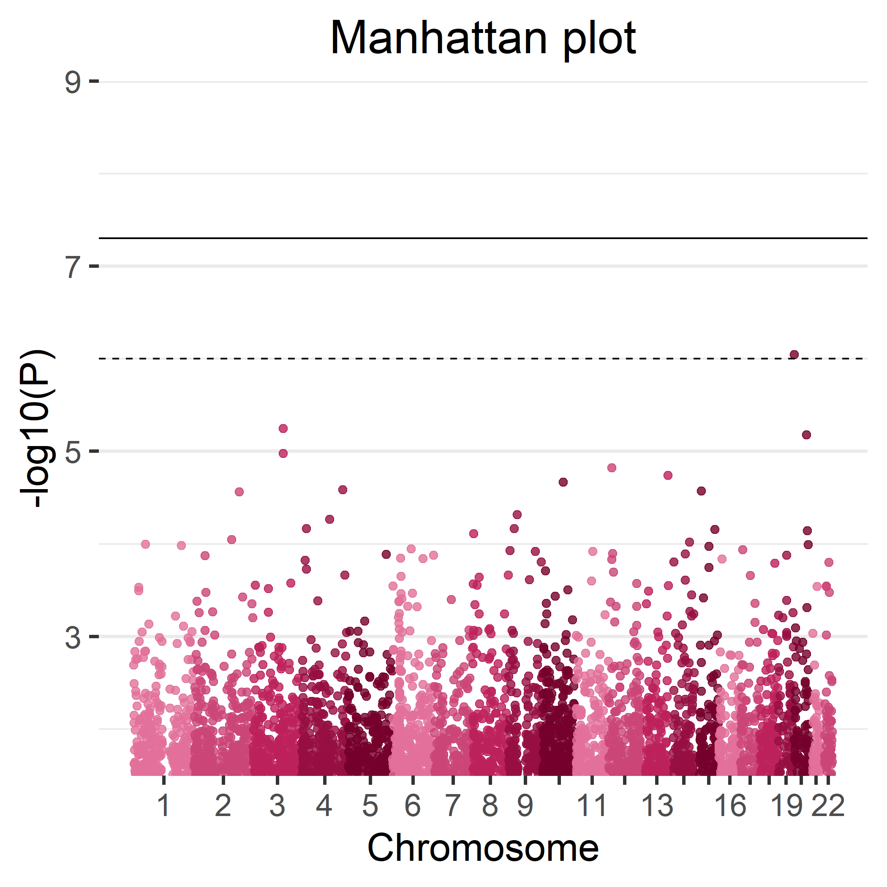

class: title-slide, middle
background-image: url(images/prbb.jpg)
background-position: right 
background-size: contain

```{r xaringan-themer, include=FALSE, warning=FALSE}
library(xaringanthemer)
library(kableExtra)
style_duo_accent(
  primary_color = "#f79729",
  secondary_color = "#ffffff",
  header_font_google = google_font("Josefin Sans"),
  text_font_google   = google_font("Montserrat", "300", "300i"),
  code_font_google   = google_font("Fira Mono")
)
extra_css <- list(
  ".footnote_s" = list("position" = "absolute",
                       "bottom" = "30px",
                       "padding-right" = "4em",
                       "font-size" = "0.6em"),
  "div.mybox" = list("border-color" = "#f79729", "border-style" = "solid",
                     "padding" = "0.5em")
)
style_extra_css(css = extra_css)
```

```{css echo = FALSE}
.title-slide h2 {
  font-size: 1.35em;
}
.center2 {
  position: relative;
  top: 50%;
  transform: translateY(25%);
}
.hide-count .remark-slide-number {
  display: none;
}
.black-count .remark-slide-number {
  color: black;
}
div.my-footer span {
    font-size: 10pt;
    color: black;
    position: absolute;
    left: 25px;
    bottom: 2px;
}
```

```{r xaringan-panelset, echo=FALSE}
xaringanExtra::use_panelset()
```

.pull-left[

# `r rmarkdown::metadata$title`

## `r rmarkdown::metadata$subtitle`

### `r rmarkdown::metadata$author`

### DataSHIELD conference, 11th of November 2021

]

---

## Outline

.pull-left[
+ **What is ShinyDataSHIELD?**
+ **Motivation**
  + Why ShinyDataSHIELD?
  + User target
+ **Technologies used**
  + DataSHIELD + Opal
  + R Shiny
  + Docker
+ **Methods implemented (by package)**
  + dsBase
  + dsSurvival
  + dsOmics
  + Miscellaneous
]

.pull-right[
+ **Deployment options**
  + Local
  + VM
  + Docker
+ **Live demo**
+ **Results**
+ **Future enhancements**
]

---

## What is ShinyDataSHIELD?

.pull-left[
```{r echo=FALSE, out.width="95%", fig.cap="ShinyDataSHIELD interface", fig.align='center'}

```
]

.pull-right[
$$\\[1.4in]$$
*ShinyDataSHIELD is a graphical user interface to interact with the DataSHIELD + Opal infrastructure. It's operation does not require knowledge of R or DataSHIELD functions.*
]

---

## Motivation

.pull-left[
.mybox[
**Why?**
+ Shorten technical gap
+ Enable quick prototyping
+ Easy data exploration and visualization
]
]

.pull-right[
.mybox[
**User target**
+ Experienced DataSHIELD researchers
  + Quick prototyping before analysis
+ Non-experienced DataSHIELD researchers
  + Hypothesis testing without depending on a researcher experienced in DataSHIELD
+ General public interested in DataSHIELD
  + Platform to explore the capabilities and performance of DataSHIELD. Help adoption!
]
]
  
---

## Technologies used

.panelset[
    
.panel[.panel-name[DataSHIELD + Opal]

The *current* implementation is only compatible with a DataSHIELD + Opal architecture, as it makes use of many `opalr` commands to function. Maybe it could be expanded to work with DataSHIELD + Molgenis Armadillo if researchers are interested.

$$\\[0.7in]$$

```{r echo=FALSE, out.width="75%", fig.align='center'}

```

]

.panel[.panel-name[R Shiny]

.pull-left[
.mybox[
+ Build web applications using R!
+ Have an R server backend:
  + Run analysis pipelines (R scripts!)
  + Automate display of results using R figures and tables (*ggplot* / *gt* / *DT* / ...)
  + *In our case:* Connect the backend server to the Opal(s)
+ Provide a code-less experience for the user
]
]

.pull-right[
```{r echo=FALSE, out.width="75%", fig.align='center'}

```
]
]
    
.panel[.panel-name[Docker]

.pull-left[
.mybox[
+ Put a service on a container:
  + 101 Explanation: Like creating a mini-computer with all the required packages to run the application. Completely agnostic of the host system packages. **Soft lie:** Like a virtual machine but much more lightweight.
+ Easy deployment of ShinyDataSHIELD 
+ Provided Dockerfile to build your own image + Image hosted on DockerHub
]
]

.pull-right[
```{r echo=FALSE, out.width="75%", fig.align='center'}

```
]
]
]

---

## Methods implemented (by package)

.panelset[
    
.panel[.panel-name[dsBase]

.pull-left[
.mybox[
+ **Descriptive statistics:**
  + Summary statistics (counts / quartiles / mean)
  + Scatter plot
  + Histogram
  + Heatmap
  + Boxplot
+ **Statistical modeling:**
  + Generalized linear models (GLM)
  + Generalized linear mixed effects models (GLMer)
]
]

.pull-right[
```{r echo=FALSE, out.width="75%", fig.align='center', fig.cap = "Figure generated using ShinyDataSHIELD"}

```
]

]
    
.panel[.panel-name[dsSurvival]

.pull-left[
```{r echo=FALSE, out.width="75%", fig.align='center', fig.cap = "Figure generated using ShinyDataSHIELD"}

```
]

.pull-right[
.mybox[
+ **Statistical modeling:**
  + Survival analysis: Cox regression models
+ **Descriptive statistics:**
  + Survival plots
]
]

]
    
.panel[.panel-name[dsOmics]

.pull-left[
.mybox[
+ **Genomics:**
  + Meta genome-wide association studies (GWAS)
  + PLINK genome-wide association studies
+ **Other omics:**
  + Linear Models for Microarray and RNA-Seq Data (Limma) models
+ **Descriptive statistics:**
  + GWAS Manhattan plots
]
]

.pull-right[
```{r echo=FALSE, out.width="75%", fig.align='center', fig.cap = "Figure generated using ShinyDataSHIELD"}

```
]

]

.panel[.panel-name[Miscellaneous]

.pull-left[
```{r echo=FALSE, out.width="55%", fig.align='center', fig.cap = "Figure is a screenshot of ShinyDataSHIELD"}
knitr::include_graphics("images/plot_editor.png")
```
]

.pull-right[
.mybox[
+ **Column visualizer / editor:**
  + Visualize the column classes of a data frame
  + Transform column classes (when DataSHIELD allows it). Example: Factor column to numeric column
+ **Plot editor:**
  + Text size
  + X-axis text angle
  + Title, subtitle and caption
  + X-axis and Y-axis labels
  + Custom legend
  + Colour themes
]
]

]
]

---

class: black-count
background-image: url(images/rothko.jpg)
background-position: bottom
background-size: contain

## Deployment options

<div class="my-footer"><span>Mark Rothko No. 5/No. 22. 1950</span></div> 

$$\\[0.2in]$$

My research center does not want / allow to host the application with Docker, am I doomed?

--

**No. I got your back.**

--

+ You can run it on your own computer via **RStudio** (got to manage package dependencies, but not *impossible!*)
+ It can also be deployed using a traditional virtual machine + Shiny Server
+ You can use someone else instance!

---

## Live demo

### Let's do some hands on DS analysis

#### Descriptive analysis on tabular data

#### GWAS analysis

---

## Results

+ The application itself.
+ A hosted demo (auto updated with the latest iteration) (https://datashield-demo.obiba.org/)
+ An online user guide (https://isglobal-brge.github.io/ShinyDataSHIELD_bookdown/)
+ A paper (waiting peer-reviewers comments):

$$\\[0.6in]$$

```{r  out.width = "65%", echo=FALSE, fig.align='center'}
knitr::include_graphics("images/paper2.png") 
```

---

## Future enhancements

.pull-left[
.mybox[
+ Translate the application to **shiny-modules**
  + Enables easier development by other researchers
  + Easier to include methods on the future
  + Future-proof the application
+ Add more methods:
  + From **dsBase** package
  + From **dsOmics** package
  + From new packages!
+ Update the figure editor to **esquisse**
  + Better interface
  + More personalization options
]
]

.pull-right[
```{r  out.width = "65%", echo=FALSE, fig.cap = "Source: xkcd comic #2268", fig.align='center'}
 
```
]

---

class: hide-count
background-image: url(images/bcn.jpeg)
background-position: left 
background-size: contain

.pull-right[
# Thank you

## Any questions?

$$\\[1.6in]$$

#### If you'd like to help, feel free to test the application and submit bugs to the GitHub issues: https://github.com/isglobal-brge/ShinyDataSHIELD/issues

#### Also, I'm open to inputs on features that should be added / human-computer interaction upgrades / ... Feel free to contact at: *xavier.escriba@isglobal.org*
]